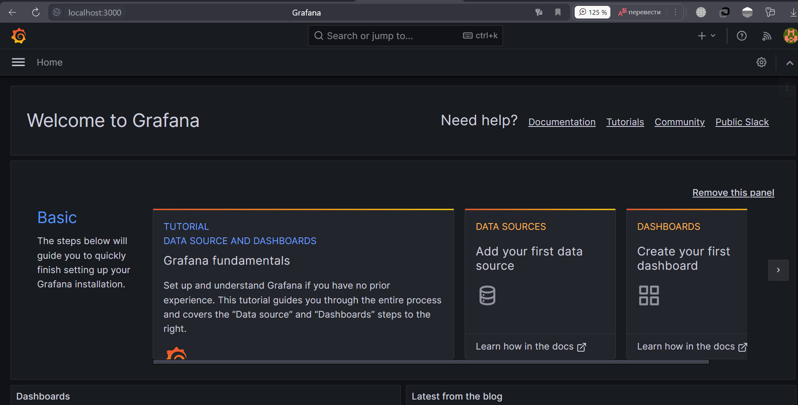
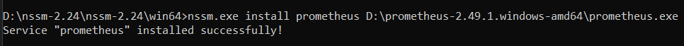
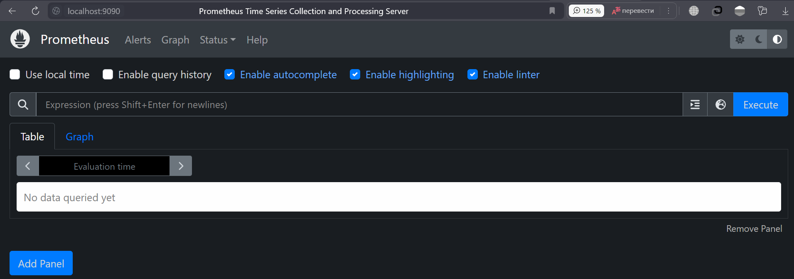
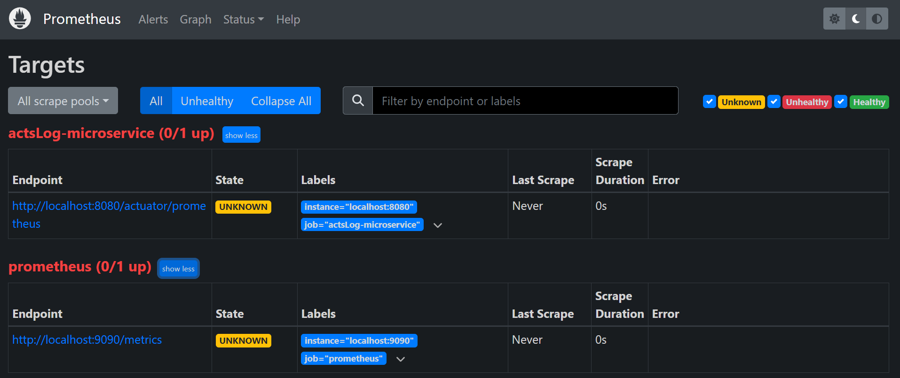
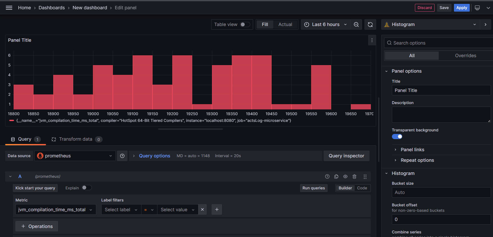
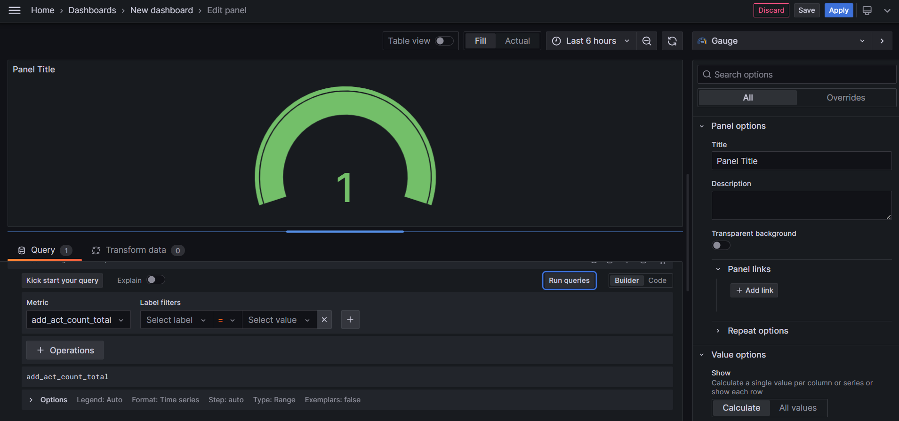

# GB-Spring
## Урок 11. Spring Actuator. Настройка мониторинга с Prometheus и Grafana.
Задание: Используйте Spring Actuator для отслеживания метрик вашего приложения. 
Настройте визуализацию этих метрик с использованием Prometheus и Grafana.

1. Устанавливаем "Grafana". Работает на порту 3000:
    
2. Устанавливаем "Prometheus" через ""nssm". Работает на порту 9090:
   
3. Проверяем запуск "Prometheus":
   
4. Добавляем зависимости в проект:
    ```xml
    <dependency>
        <groupId>org.springframework.boot</groupId>
        <artifactId>spring-boot-starter-actuator</artifactId>
    </dependency>
    
    <dependency>
        <groupId>io.micrometer</groupId>
        <artifactId>micrometer-core</artifactId>
        <version>1.12.2</version>
    </dependency>
    <dependency>
        <groupId>io.micrometer</groupId>
        <artifactId>micrometer-registry-prometheus</artifactId>
        <version>1.12.2</version>
    </dependency>
    ```
5. Добавлякм в YAML-файл наш микросервис:
    ```yaml
   - job_name: "actsLog-microservice"
     metrics_path: "actuator/prometheus"
     static_configs:
     - targets: ["localhost:8080"]
     ```
   [Файл prometheus.yml](resourses/yaml/prometheus.yml)
   
6. Добавляем Prometheus в Grafana:
   
7. Дбавляем свои метрики в контроллер:
   ```java
   private final Counter addActCounter = Metrics.counter("add_act_count");
   private final Timer findAllActsTimer = Metrics.timer("find_acts_timer");
   
   @GetMapping("/acts")
   public String findAll(Model model) {
     findAllActsTimer.baseTimeUnit();
     List<Act> acts = actService.getAllActs();
     model.addAttribute("acts", acts);
     return "act-list";
   }
   
   @GetMapping("/act-create")
   public String createActForm(Act ignoredAct) {
     addActCounter.increment();
     return "act-create";
   }
   ```
   

[Ссылка на проект, к которому подключали Prometheus и Grafana](https://github.com/Ergakoff-Igor/GB-Spring-Homework10.git)
    
